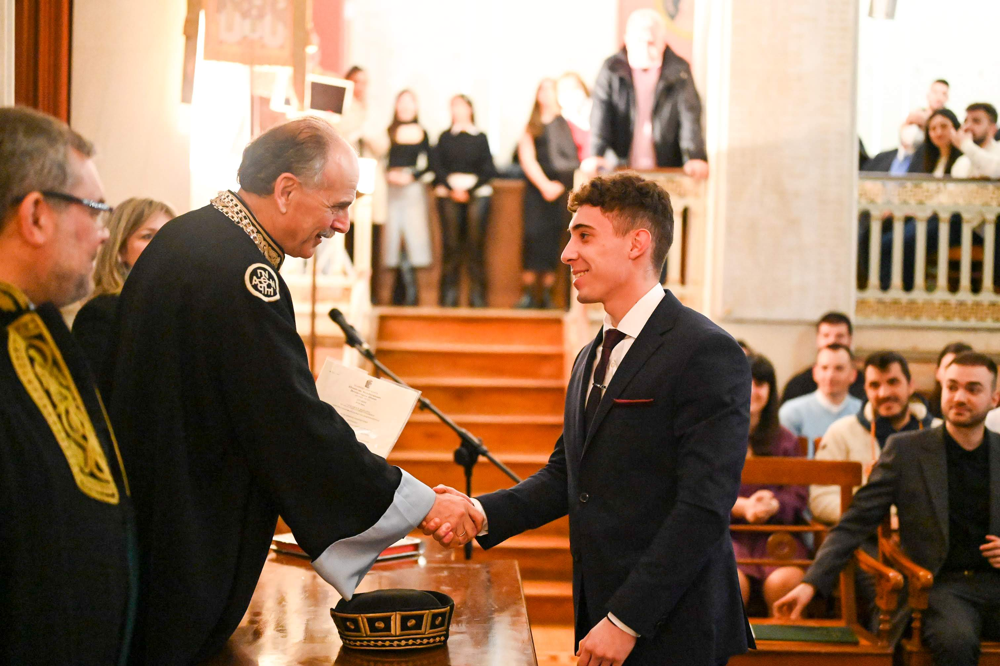
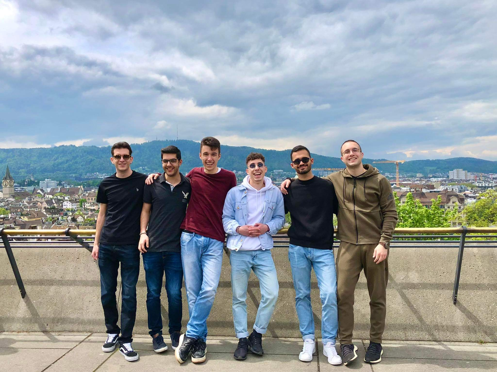
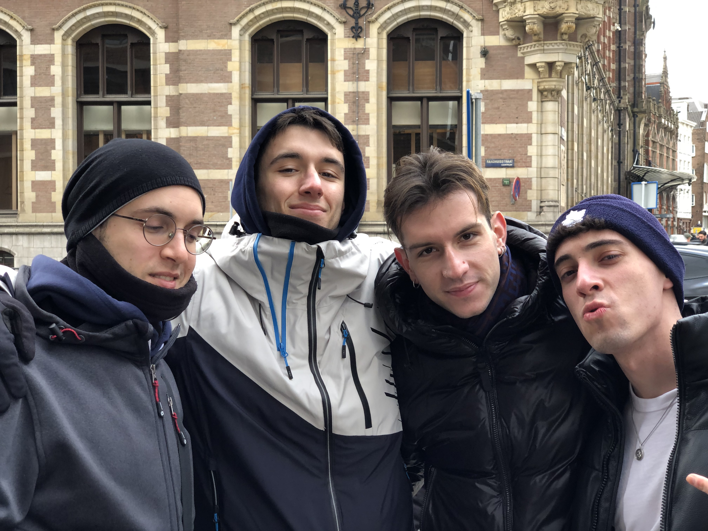
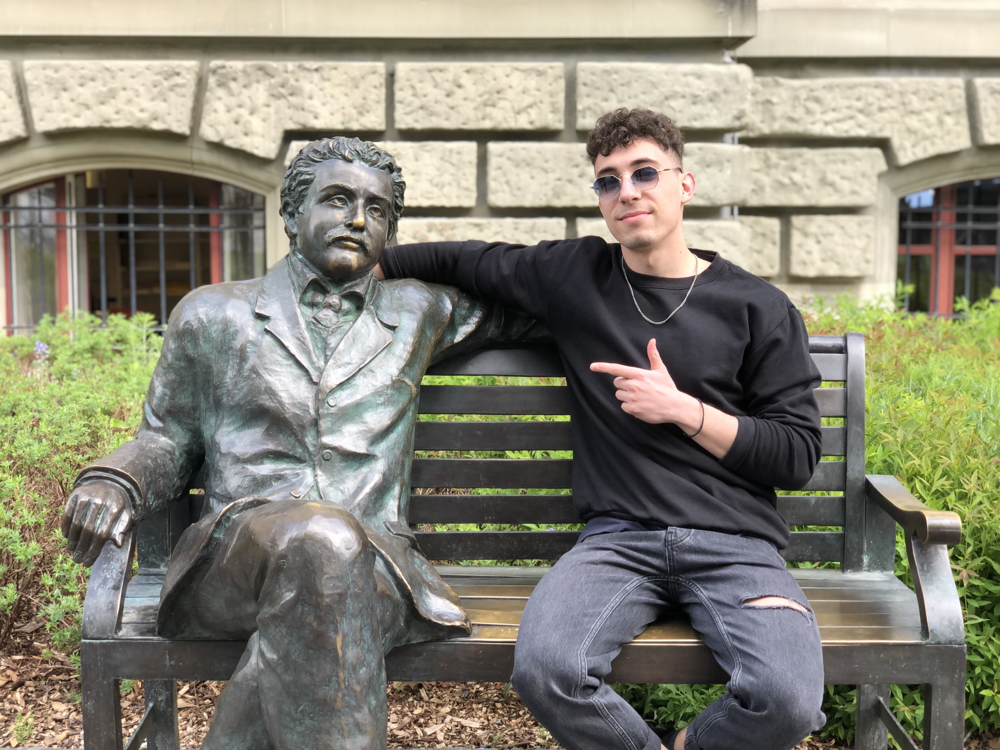

# TENANT PROPOSAL: VASILEIOS VASILAKIS
## WHO AM I
Many greetings! My name is Vasileios, but my acquaintances and close friends call me Bill :) 
I am 23 years young, coming from Athens, Greece. I plan to move to Zurich in September to start
my Master's degree in Computer Science at ETH.
## EDUCATION & WORK EXPERIENCE
I hold a Bachelor's (BSc) degree in Computer Science from the University of Athens. My main interests 
revolve around algorithmic design, artificial intelligence and teaching, one of my passions. This past year I've
been employed as a software engineer in the industry, before returning to academia.
## HOBBIES
Regarding hobbies, one major enjoyment of mine are sports. I've been training calisthenics for the last 6 years, and
I also like to consider myself a pretty decent basketball player. Lately boxing and mma have caught my interest and I
definitely plan to start getting more into that in the future.

Reading books is another activity I'm really keen on. Exploring the mind and the ideas of remarkable people intrigues me and helps
me improve as an individual.

Last but not least, above all I enjoy socializing. I love travelling and long deep meaningful conversations. Moving abroad is an ideal opportunity for me to 
meet new interesting people, exchange ideas, explore new perspectives and better myself as a result.

## BEHAVIOR AS A TENANT, FLATMATE AND ROOMATE
In terms of character, I would describe myself as an introverted extrovert. Easy-going, laid-back, quiet yet social.
Therefore, I believe I can co-exist smoothly with any type of flatmate, socializing with
extroverted ones and respecting the stricter boundaries of more introverted ones.

In terms of lifestyle, I usually spend time inside the house to sleep or study. When I'm not doing any of the above I prefer to be outside.

I also value proper hygiene. I wash my most recently used clothes and I vacuum and mop my room and shared spaces weekly.

Cooking is not one of my strong points yet, but I am improving and I always clean up. I don't like leaving a mess in the kitchen. 

I don't smoke or vape, and I avoid alcohol. 

It goes without saying that I respect quiet hours and the privacy of the other flatmates, as I expect my flatmates to respect that as well.

I believe that I have extensive experience with various accommodation options and I am confident that I will quickly adapt to any
given setup.

## EXPECTATIONS FROM OTHER FLATMATES
My boundaries with respect to sharing an apartment, revolve around 2 baseline points:
1) respecting quiet hours on a regular basis, and
2) preserving some basic hygiene level in shared spaces.
## PICTURES
Some pictures of me :)  
<figure>
  
  <figcaption>Recieving my graduation degree. As the class valedictorian, I read the oath.</figcaption>
</figure>
 
<figure>
  
  <figcaption>Me and my best friends in Zurich (first time visiting Switzerland)</figcaption>
</figure>
<figure>
  
  <figcaption>With the guys in Amsterdam.</figcaption>
</figure>
<figure>
  
  <figcaption>Hanging out with Albert Einstein in Bern.</figcaption>
</figure>

